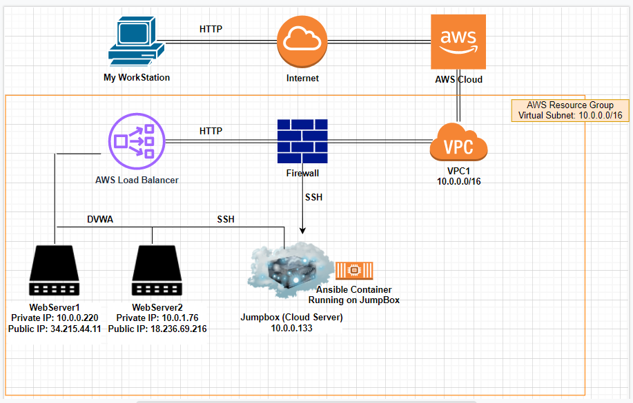

## Automated ELK Stack Deployment

The files in this repository were used to configure the network depicted below.

These files have been tested and used to generate a live ELK deployment on Azure. They can be used to either recreate the entire deployment pictured above. Alternatively, select portions of the _____ file may be used to install only certain pieces of it, such as Filebeat.

  - _filebeat-playbook.yaml_

This document contains the following details:
- Description of the Topologu
- Access Policies
- ELK Configuration
  - Beats in Use
  - Machines Being Monitored
- How to Use the Ansible Build

### Description of the Topology

The main purpose of this network is to expose a load-balanced and monitored instance of DVWA, the D*mn Vulnerable Web Application.

Load balancing ensures that the application will be highly AVAILABLE, in addition to restricting ACCESS to the network.
- _TODO: What aspect of security do load balancers protect? What is the advantage of a jump box?_
denial-of-service (DDoS) attacks by off-loading the data from the organization's server to a cloud server. Jump boxes provide organizations with a clear and straightforward starting server, where they can then securely access other servers.

Integrating an ELK server allows users to easily monitor the vulnerable VMs for changes to the EVENT LOGS and system METRICS.
- _TODO: What does Filebeat watch for?_
Filebeat watches for log files or locations ultimately for forwarding and centralizing them.
- _TODO: What does Metricbeat record?_
Metricbeat records metrics from the operating system and services on the server and sends them to an output.

The configuration details of each machine may be found below.
_Note: Use the [Markdown Table Generator](http://www.tablesgenerator.com/markdown_tables) to add/remove values from the table_.

| Name      |  Function  | IP Address | Operating System |
|---------- | ---------- |------------|------------------|
| Jump Box  | Gateway    | 10.0.0.133 | Amazon Linux     |
| WebServer1| AWS Server | 10.0.0.220 | Amazon Linux     |
| WebServer2| AWS Server | 10.0.1.76  | Amazon Linux     |
| Elk-Server| AWS Server | 10.0.0.174 | Ubuntu           |

### Access Policies

The machines on the internal network are not exposed to the public Internet. 

Only the JUMPBOX machine can accept connections from the Internet. Access to this machine is only allowed from the following IP addresses:
- _TODO: Add whitelisted IP addresses_
10.0.0.0/254
Machines within the network can only be accessed by 10.0.0.220.
- _TODO: Which machine did you allow to access your ELK VM? What was its IP address?_

A summary of the access policies in place can be found in the table below.

| Name      | Publicly Accessible | Allowed IP Addresses |
|---------- |---------------------|----------------------|
| Jump Box  | Yes                 | 10.0.0.133           |
| WebServer1| NO                  | 10.0.0.220           |
| WebServer2| NO                  | 10.0.1.220           |
| ELK       | NO                  | 10.0.0.220           |
### Elk Configuration

Ansible was used to automate configuration of the ELK machine. No configuration was performed manually, which is advantageous because...
- _TODO: What is the main advantage of automating configuration with Ansible?_
Ansible was used to automate configuration of the ELK machine. No configuration was performed manually, which is advantageous because the process of configuring the ELK machine became faster, IT admins have time to focus on other aspects for success, and everything is configured the same way every time.

The playbook implements the following tasks:
- The first step of the playbook is to install docker.io with a present state.
- The second step of the playbook is to increase virtual memory with the command sysctl -w vm.max_map_count=262144.
- The third step of the playbook is to install pip with a present state.
- The fourth step of the playbook is to install docker python module with a present state.
- The fifth step of the playbook is to download and launch a docker web container with the image sebp/elk:761, a started state, and published ports of 5601, 9200, and 5044

### Target Machines & Beats
This ELK server is configured to monitor the following machines:
- WebServer1, 10.0.0.220
- WebServer2, 10.0.0.76

We have installed the following Beats on these machines:
- Filebeat
- Metricbeat

These Beats allow us to collect the following information from each machine:
- Filebeat collects log events from the log files and locations that it monitored. An example of what I expect to see is logs from MySQL.
- Metricbeat collects metrics from the operating system and services on the server. An example of what I expect to see is CPU usage logs.

### Using the Playbook
In order to use the playbook, you will need to have an Ansible control node already configured. Assuming you have such a control node provisioned: 

SSH into the control node and follow the steps below:
- Copy the PLAYBOOK file to ANSIBLE.
- Update the CONFIG file to include YOUR ELK PRIVATE IP ADDRESS
- Run the playbook, and navigate to http://[your.VM.IP]:5601/app/kibana to check that the installation worked as expected.
